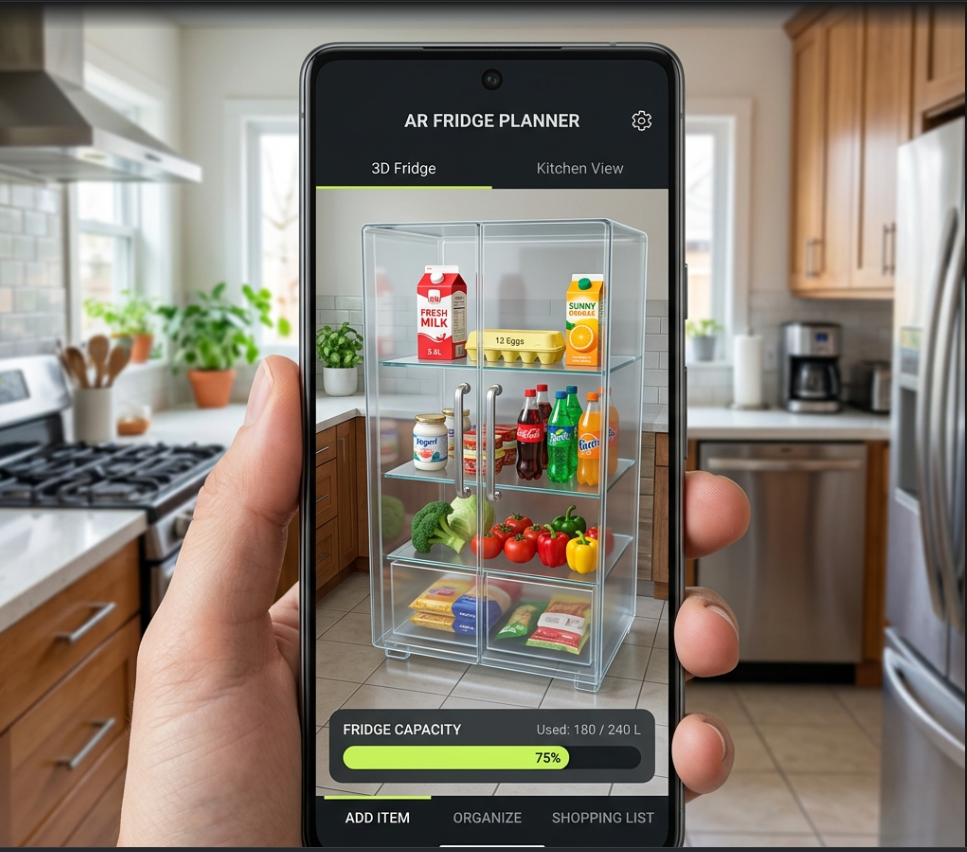

# 🍎 MeraFridge | Smart Nutrition & Space Tracker

MeraFridge is a WebXR-powered application built with **Vite** and **Three.js**. It helps you visualize if your groceries will fit in your fridge using Augmented Reality while tracking nutrition information including calories, protein, carbs, and fats.



## 🛠 Tech Stack
- **Engine**: Three.js
- **Build Tool**: Vite
- **Language**: JavaScript (ESM)
- **Styling**: Vanilla CSS (Glassmorphism)

## 🚀 Local Development

1. **Install Dependencies**:
   ```bash
   npm install
   ```

2. **Run Dev Server**:
   ```bash
   npm run dev
   ```

3. **Preview AR on Mobile**:
   Vite will provide a local IP address. Open that on your mobile browser (ensure you are on the same WiFi).
   *Note: AR often requires HTTPS. You may need to use a tool like `ngrok` or Vite's `--https` flag for mobile testing.*

## ✨ Features

- **Transparent Glass Fridge**: Realistic 3D fridge with chrome frame and clear glass walls
- **Nutrition Tracking**: Real-time tracking of calories, protein, carbs, and fats
- **Health Indicators**: Happy 😊 or sad 😕 emoji indicators for food nutritional value
- **Item Details**: Each item shows calories and macros when added
- **AR Placement**: Place and visualize your fridge in real-world space using WebXR

## 📦 Fork and Deployment to GitHub Pages

MeraFridge is configured with **GitHub Actions** for automated deployment. Clone the code and fork it in your local repo

1. **Push to main**: Simply push your code to the `main` branch.
   ```bash
   git add .
   git commit -m "feat: automated deploy"MeraFridge/`.

## 📱 Mobile AR Usage
- Open the live URL on a WebXR-compatible browser (e.g., Chrome on Android).
- Grant camera permissions.
- Tap "ENTER AR" to start the AR experience.
- Point your camera at a flat surface to place your virtual fridge.
- Add items and track their nutrition in real-time!es are set to **"GitHub Actions"** under the **Build and deployment > Source** section.

Your app will be live at `https://YOUR_USERNAME.github.io/GrocBot/`.

## 📱 Mobile AR Usage
- Open the live URL on a WebXR-compatible browser (e.g., Chrome on Android).
- Grant camera permissions.
- Tap "START AR" to enter the spatial preview.
- Point your camera at a flat surface to place your virtual fridge.
